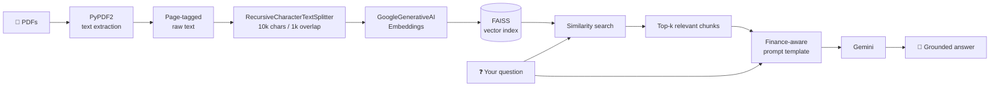

<div align="center">

# 📄 Chat with Multiple PDFs

### A finance-aware RAG analyst for annual reports and financial statements

Upload a stack of annual reports, and ask questions in plain English.
Built with **LangChain**, **Google Gemini**, and **FAISS** — wrapped in a clean **Streamlit** chat UI.

[](https://streamlit.io/)
[](https://www.python.org/)
[](https://www.langchain.com/)
[](https://ai.google.dev/)
[](LICENSE)

[](https://multi-pdf-rag-analyzer.streamlit.app/)

**[🚀 Live Demo](https://multi-pdf-rag-analyzer.streamlit.app/)** · [Features](#-features) · [Quick Start](#️-installation) · [How It Works](#-how-it-works)

</div>

---

## 💡 Why this exists

Annual reports are where companies tell you the truth — buried on page 214, in a
related-party-transactions note nobody reads.

A single Indian listed company's annual report runs 200–400 pages. Comparing five of
them by hand is a weekend of work. `Ctrl+F` doesn't help, because the question you
actually want answered isn't a keyword — it's *"did operating cash flow keep up with
reported profit, and if not, why?"*

This tool loads all of those PDFs at once, indexes them semantically, and lets you
interrogate them like you'd interrogate an analyst. It is deliberately **not** a
general-purpose chatbot: the system prompt is tuned to think like a sceptical
financial analyst hunting for red flags.

---

## ✨ Features

| | Feature | What it does |
|---|---|---|
| 📄 | **Multi-PDF ingestion** | Upload any number of PDFs at once and query across all of them simultaneously |
| 🔍 | **Source-tagged chunks** | Every chunk carries its filename and page number, so answers can cite where a figure came from |
| 🧠 | **Finance-aware prompting** | The LLM is instructed to behave like an analyst — ratios, red flags, related-party dealings, KMP pay |
| 🚫 | **Anti-hallucination guardrails** | The model must answer only from the documents, and say so explicitly when the answer isn't there |
| 🗃️ | **FAISS vector store** | Fast local similarity search; the index is persisted to `faiss_index/` and reused within a session |
| 🎛️ | **Model picker** | Switch between Gemini chat models and embedding models without touching code |
| 🌡️ | **Tunable retrieval** | Adjust temperature and how many chunks feed each answer |
| 🗨️ | **Custom chat UI** | Hand-rolled HTML/CSS chat bubbles with user/bot avatars and properly rendered markdown tables |
| 📥 | **CSV export** | Download the full conversation, timestamped, for your records or research notes |
| 🔐 | **Bring your own key** | Your API key is entered at runtime and never stored or committed |

---

## 🖼️ Interface

The app is split into a configuration sidebar and a chat surface:

```
┌────────────────────────┬──────────────────────────────────────────────┐
│  ⚙️  Configuration      │   📄 Chat with Multiple PDFs                 │
│                        │                                              │
│  Google AI API Key     │   🧑‍💼 YOU                                     │
│  [ ●●●●●●●●●●●●●● ]    │   Compare debt-to-equity across all reports.  │
│                        │                                              │
│  Chat model      ▾     │   🤖 GEMINI ANALYST                           │
│  Embedding model ▾     │   | Company   | FY23 | FY24 | Trend |         │
│                        │   |-----------|------|------|-------|        │
│  ▸ Advanced            │   | Company A | 0.82 | 1.14 |  ▲    |        │
│                        │   | Company B | 0.41 | 0.38 |  ▼    |        │
│  📄 Your documents     │                                              │
│  [ Upload PDFs      ]  │   Key takeaways                              │
│  [ Process Documents ] │   • Company A's leverage rose 39% …           │
│                        │                                              │
│  📥 Export chat as CSV │   [ Ask a question about your documents… ]    │
└────────────────────────┴──────────────────────────────────────────────┘
```

---

## 🔐 Google AI API Key

The app needs a Google AI API key for both embeddings and chat completions.

1. Visit **[Google AI Studio](https://aistudio.google.com/app/apikey)**
2. Click **Create API key** (the free tier is generous enough for testing)
3. Paste it into the **Google AI API Key** field in the app's sidebar

Alternatively, copy `.env.example` to `.env` and set `GOOGLE_API_KEY` — the sidebar
will pick it up automatically on launch.

> [!IMPORTANT]
> The key lives only in your browser session and is sent directly to Google's API.
> It is never written to disk, logged, or committed — `.env` and
> `.streamlit/secrets.toml` are both gitignored.

---

## 🛠️ Installation

### 1. Clone the Repository

```bash
git clone https://github.com/tirth1263/Multi-PDF-RAG-Analyzer.git
cd Multi-PDF-RAG-Analyzer
```

### 2. Set Up a Virtual Environment

```bash
# macOS / Linux
python -m venv venv
source venv/bin/activate

# Windows (PowerShell)
python -m venv venv
.\venv\Scripts\Activate.ps1
```

### 3. Install Required Dependencies

```bash
# Using pip
pip install -r requirements.txt

# Or using uv (recommended — much faster)
uv pip install -r requirements.txt
```

### 4. Run the App

```bash
streamlit run app.py
```

The app opens at `http://localhost:8501`. Paste your API key, upload PDFs, hit
**Process Documents**, and start asking.

---

## 📖 How It Works

This is a textbook **Retrieval-Augmented Generation (RAG)** pipeline, with a few
finance-specific twists:



**Step by step:**

1. **Extract** — `PyPDF2` pulls text from every page. Each page is prefixed with
   `[Source: filename | Page N]` so provenance survives into the index.
2. **Chunk** — `RecursiveCharacterTextSplitter` cuts the text into 10,000-character
   chunks with 1,000 characters of overlap, so a table split across a boundary still
   appears intact in at least one chunk.
3. **Embed** — each chunk becomes a vector via Google's embedding model.
4. **Index** — vectors go into a FAISS index, persisted to `faiss_index/`.
5. **Retrieve** — your question is embedded and matched against the index; the top-k
   chunks are pulled back.
6. **Generate** — those chunks plus your question are poured into the finance-aware
   prompt template, and Gemini answers *only* from what it was given.

---

## 🧠 Prompt Template Logic

The system prompt is what turns a generic chatbot into an analyst. It instructs the
model to:

- **Evaluate financial statements** — revenue, margins, debt-to-equity, interest
  coverage, working capital, and trends across every period available
- **Detect irregularities and red flags** — cash flow from operations diverging from
  net profit, ballooning receivables or inventory, frequent auditor/CFO changes,
  qualified audit opinions, contingent liabilities, pledged promoter shares
- **Analyse related party transactions** — who, how much, what for, and whether
  anything looks circular, oversized, or thinly explained
- **Scrutinise managerial remuneration** — KMP pay, its growth rate, and how that
  compares with profit growth and median employee pay

Three hard rules keep it honest:

> 1. Never invent a number — every figure quoted must appear in the retrieved context
> 2. If the answer isn't in the documents, say so explicitly rather than guessing
> 3. Show the arithmetic for any calculated figure, so the reader can verify it

---

## 🧪 Sample Use Cases

| Ask this | And you get |
|---|---|
| *"Compare the debt-to-equity ratio across all 5 uploaded annual reports."* | A comparison table with the trend for each company |
| *"List every related party transaction and flag anything unusual."* | Parties, amounts, nature of dealing, plus flagged concerns |
| *"How well did cash flow from operations convert from net profit over 3 years?"* | A CFO/PAT conversion analysis with the working shown |
| *"How much did Key Managerial Personnel pay rise year on year?"* | KMP remuneration growth, benchmarked against profit growth |
| *"Are there any qualified opinions or emphasis-of-matter paragraphs?"* | Auditor commentary extracted and summarised |
| *"What contingent liabilities are disclosed, and how have they moved?"* | Contingent liability schedule with period-on-period movement |

---

## 📦 Tech Stack

| Tech | Purpose |
|---|---|
| **Streamlit** | UI framework for interactive web apps |
| **LangChain** | Managing LLM chains, prompts and embeddings |
| **Google Gemini** | Large Language Model (via Google AI API) |
| **PyPDF2** | PDF text extraction |
| **FAISS** | Vector database for similarity search |
| **Pandas** | Exporting conversation as CSV |
| **Markdown** | Rendering model output inside custom chat bubbles |
| **HTML/CSS** | Custom chat UI inside Streamlit |

---

## 📂 File Structure

```
├── app.py                  # Main Streamlit app — the whole pipeline lives here
├── requirements.txt        # Required Python packages
├── .streamlit/
│   └── config.toml         # Theme and upload-size configuration
├── .env.example            # Template for your API key
├── faiss_index/            # Folder where the vectorstore is saved (gitignored)
├── LICENSE                 # MIT
└── README.md               # You're here!
```

---

## ☁️ Deploy Your Own

The app is deployment-ready for **Streamlit Community Cloud** (free):

1. Fork this repository
2. Go to [share.streamlit.io](https://share.streamlit.io) and sign in with GitHub
3. Click **Create app** → pick your fork → set the main file to `app.py`
4. Deploy

No secrets configuration is required — users supply their own API key in the sidebar.

---

## ⚠️ Notes & Limitations

- **Scanned PDFs won't work.** `PyPDF2` reads embedded text, not images. If a report
  is a scan, it needs OCR first — the app will tell you when it finds no text.
- **Model availability varies by key.** `gemini-1.5-flash` is retired for newer API
  keys; the sidebar defaults to `gemini-2.5-flash`. If you hit a *model not found*
  error, pick a different model from the dropdown.
- **Long reports cost tokens.** A 300-page annual report is a lot of embedding calls.
  The free tier handles a few reports comfortably; heavy use needs a paid key.
- **The index is per-session.** Streamlit Cloud's filesystem is ephemeral, so
  documents are re-processed when the app restarts.
- **This is an analysis aid, not investment advice.** Always verify figures against
  the source document before acting on them.

---

## 🤝 Contributing

Issues and pull requests are welcome. Ideas that would make good contributions:

- OCR fallback for scanned reports (Tesseract / `unstructured`)
- Persistent vector storage so indexes survive restarts
- Chart generation from extracted financial tables
- Multi-turn memory so follow-up questions carry context

---

## 📜 License

Released under the [MIT License](LICENSE) — free to use, modify and distribute.

---

<div align="center">

**Built by [tirth1263](https://github.com/tirth1263)**

⭐ If this saved you a weekend of reading annual reports, consider starring the repo.

</div>
